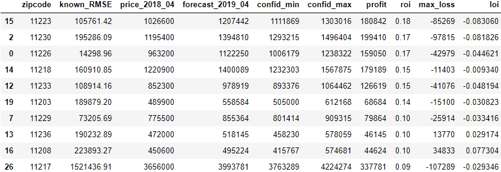
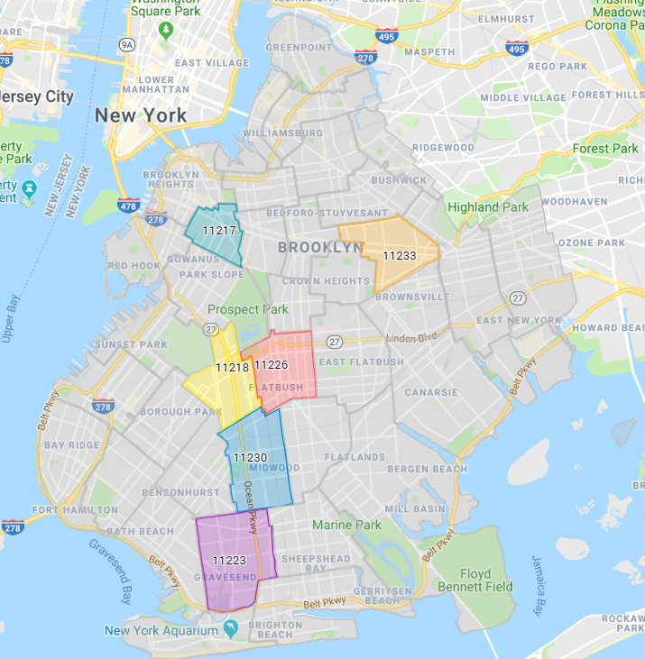

# Overview  

In this project I am working with data from Zillow to try to predict sales prices in the future. The goal is to see which zipcodes would make the most sense to invest in with regards to profit and return on investment in 12 months.  

I will look at all three of these parameters when making my recommendations for these reasons: 
  
**Profit** - Tells us in dollar amount how much we estimate can be made as well as confidence intervels with a min and max profit margin.  
  
**Return on investment** - Percentage that can be gained, this metric can tell us if the amount we are able to make is a small or big precentage. This will help with understanding that even if a big profit can be made, this may be more of a risk with regards to small market swings. 

  
### City  

I will be looking at zipcodes in Kings County, NY, of which there are 28 zipcodes.   

Map of zipcodes in Kings County, NY

## Findings

Here is the graph for what I would consider is the best zipcode that I found:

As can be seen, there is a good amount of growth at the 12 month mark and the lowest predicted price is higher then the original buying price.

Here are the 10 best zipcodes by profit:

Here are the 10 best by return on investment:

Here is what each column refers to:  
**known_RMSE**: RMSE for the data that I have, checked against the predictions made.  
**Forecast_2019_04**: A forecast for 12 months in the future  
**confid_min and confid_max**: The confidence min and max  
**profit**: The dollar amount of profit based on the predicted value in 12 months.  
**roi**: Return on investment percentage  
**2018_04_price**: The price at the buying time, which was the last date in the data.  
**max_loss**: The 2018 price minus the min in 12 months, if this is a positive number then there is a loss, if this is a negative number then there is no predicted loss, even if sold for the lowest predicted price in 12 months.  
**loi**: Loss on investment percentage, as above, if it is positive then there is a loss, if it is negative then there is no predicted loss, even if sold for the lowest predicted price in 12 months  

Here is a picture showing what I would consider the top 6 zipcodes, these are the ones that are on both of the above lists:

Here are the best zipcodes shown on a map:

## Recommendations

I would recommend buying in the above 6 zipcodes and there is a good predicted profit and return on investment to be made with low predicted risk.
